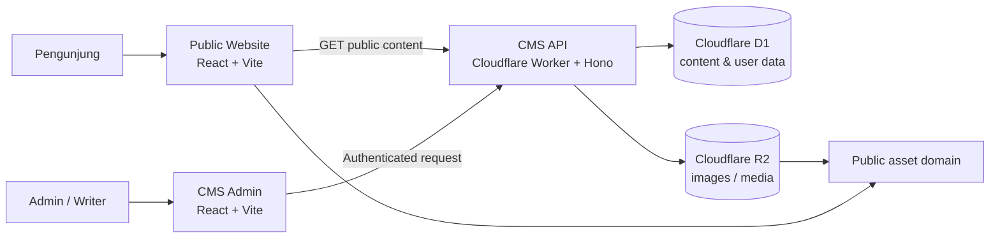
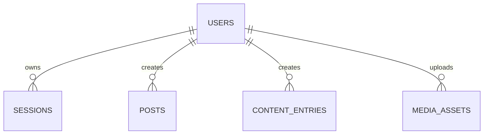
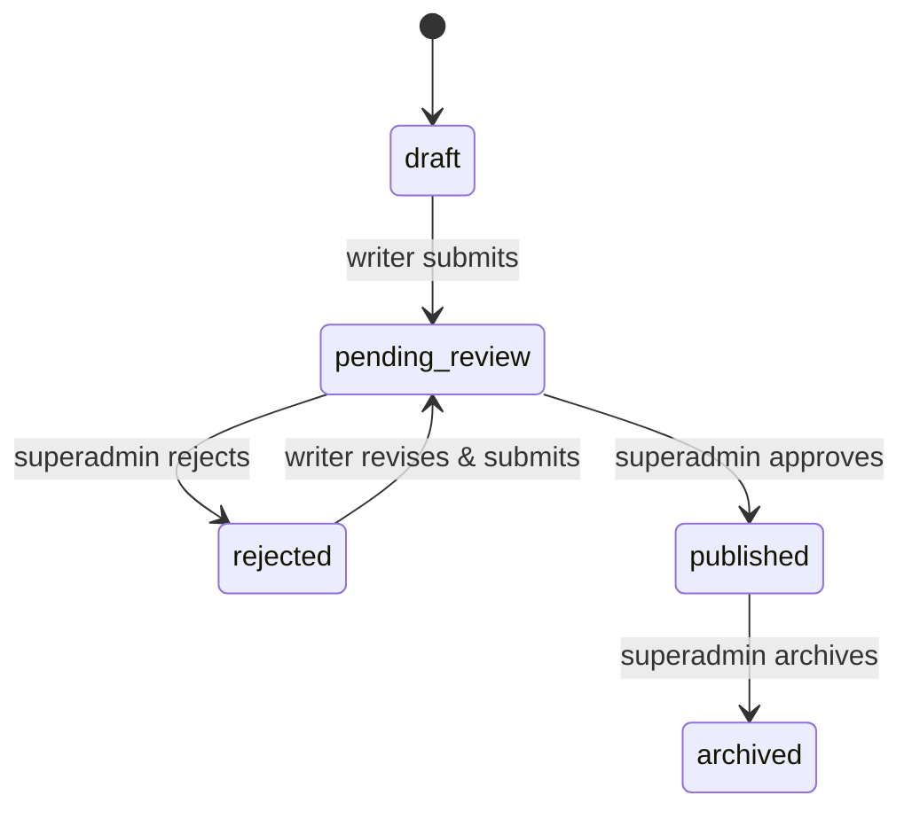

# System Design — Single Website, Single CMS

Dokumen ini adalah blueprint untuk membuat **satu website company profile / content website** dengan **satu CMS khusus**. Polanya mengambil fondasi CMS di repository ini, tetapi menghapus kompleksitas multi-site: tidak ada `site_id`, site selector, atau tabel `sites`.

Tujuan utamanya sederhana: public website tetap cepat dan statis, sementara konten, artikel, SEO, dan media dapat dikelola dari dashboard admin terpisah.

## 1. Arsitektur yang dipakai



| Layer | Pilihan | Tanggung jawab |
| --- | --- | --- |
| Public website | React 18, TypeScript, Vite, Tailwind CSS | Menampilkan company profile, halaman dinamis, dan blog. |
| CMS admin | React 18, TypeScript, Vite, Tailwind CSS, Tiptap | Login, membuat konten, upload media, review, dan publish. |
| API | Cloudflare Worker + Hono | Auth, validasi, workflow konten, dan API publik/admin. |
| Database | Cloudflare D1 (SQLite) | User, session, content, post, dan metadata media. |
| File storage | Cloudflare R2 | Gambar yang diunggah dari CMS. |
| Hosting | Cloudflare Pages | Deploy public website dan CMS admin. |
| Domain | Cloudflare DNS | Domain public, subdomain API, admin, dan asset. |

## 2. Bentuk repository yang direkomendasikan

```txt
project-root/
├─ website/                 # public website React/Vite
├─ cms-admin/               # dashboard React/Vite
├─ cms-api/                 # Cloudflare Worker + Hono
│  ├─ migrations/
│  └─ src/
│     ├─ routes/
│     ├─ db/
│     ├─ middleware/
│     └─ utils/
├─ docs/
│  └─ SYSTEM_DESIGN.md
└─ README.md
```

Jika memakai satu repository, setiap aplikasi tetap memiliki `package.json` sendiri agar deploy dan environment variable tidak saling bercampur.

## 3. Penyederhanaan dari CMS repository ini

| Yang ada sekarang | Versi single-site yang disarankan |
| --- | --- |
| Satu API melayani banyak domain melalui tabel `sites` dan `site_id` | Hapus tabel `sites` dan seluruh kolom/filter `site_id`. |
| Site selector di admin | Hilangkan; admin langsung masuk ke dashboard website tersebut. |
| `TYPES_BY_SITE` mengunci content type per situs | Ganti menjadi satu `CONTENT_TYPES` config milik proyek. |
| R2 key `blog-assets/{site_id}/...` | Gunakan `assets/{yyyy}/{mm}/{uuid}-{fileName}`. |
| `CMS_ALLOWED_ORIGINS` berisi banyak domain | Isi hanya URL public site dan URL admin. |
| Satu admin untuk beberapa brand | Satu admin khusus untuk satu brand/domain. |

Jangan menghapus konsep yang masih berguna: role, status publish, session cookie HttpOnly, validasi slug, metadata SEO, alt text, D1 migration, dan pemisahan public/admin API.

## 4. Resource Cloudflare dan domain

Contoh penamaan (ganti `brand` dengan nama proyek):

```txt
Cloudflare Pages
  brand-web           → https://www.brand.com
  brand-cms-admin     → https://cms.brand.com

Cloudflare Worker
  brand-cms-api       → https://api.brand.com

Cloudflare D1
  brand_cms_db

Cloudflare R2
  brand-cms-assets

Asset public
  https://assets.brand.com
```

`cms.brand.com` dan `api.brand.com` berada di root domain yang sama agar cookie session dapat dipakai lintas subdomain. Jika memakai domain berbeda, lebih aman gunakan autentikasi token yang didesain khusus; jangan mengandalkan cookie lintas domain.

## 5. Model konten

Gunakan dua bentuk data agar CMS tetap fleksibel tanpa menjadi page builder yang berlebihan.

1. **`posts`** untuk artikel, berita, atau insight dengan rich-text body.
2. **`content_entries`** untuk konten terstruktur pada halaman company profile.

Contoh `content_type` yang umum:

```ts
export const CONTENT_TYPES = [
  "page",           // halaman statis: about, contact, privacy
  "site_settings",  // logo, kontak, social links, CTA
  "service",        // layanan
  "team_member",    // profil tim
  "portfolio",      // karya / case study
  "testimonial",
  "faq",
] as const;
```

`data_json` menyimpan field yang spesifik untuk setiap type, misalnya `service` memiliki `{ icon, shortDescription, order }`, sedangkan `site_settings` memiliki `{ phone, email, address, instagram }`. Frontend harus punya TypeScript type dan fallback yang sesuai; jangan merender JSON arbitrer langsung ke DOM.

## 6. Database minimum



Tabel minimum:

| Tabel | Fungsi | Field penting |
| --- | --- | --- |
| `users` | Akun CMS | `id`, `email`, `password_hash`, `role`, `status` |
| `sessions` | Sesi login yang tokennya disimpan sebagai hash | `id`, `user_id`, `token_hash`, `expires_at` |
| `posts` | Artikel/blog/news | `title`, `slug`, `content`, `status`, SEO fields, audit fields |
| `content_entries` | Data terstruktur untuk section/halaman | `content_type`, `locale`, `slug`, `data_json`, `status`, SEO fields |
| `media_assets` | Metadata file R2 | `file_key`, `public_url`, `mime_type`, `size_bytes`, `uploaded_by` |

Semua tabel konten perlu field audit: `created_by`, `updated_by`, `approved_by`, `approved_at`, `published_at`, serta alasan penolakan. Buat unique index `posts.slug` dan `content_entries(content_type, locale, slug)`.

## 7. Role dan workflow



| Role | Hak akses |
| --- | --- |
| `superadmin` | Kelola semua konten/media, approve, reject, publish, archive. |
| `admin_writer` | Membuat dan mengubah miliknya sendiri selama `draft` atau `rejected`, lalu submit review. |

Jika proyek hanya memiliki satu pengelola konten, tetap pertahankan kedua role. Akun owner bisa `superadmin`; role writer membuat workflow siap dipakai saat tim bertambah.

## 8. Kontrak API

Public endpoint tidak memerlukan login dan hanya mengembalikan content berstatus `published`.

```txt
GET  /public/health
GET  /public/posts?page=1&limit=12
GET  /public/posts/:slug
GET  /public/content?type=service&locale=id
GET  /public/content/:type/:slug?locale=id
```

Admin endpoint memakai session cookie HttpOnly:

```txt
POST /auth/login
POST /auth/logout
GET  /auth/me

GET    /admin/posts
POST   /admin/posts
GET    /admin/posts/:id
PUT    /admin/posts/:id
DELETE /admin/posts/:id
PATCH  /admin/posts/:id/submit-review
PATCH  /admin/posts/:id/approve
PATCH  /admin/posts/:id/reject
PATCH  /admin/posts/:id/status

GET    /admin/content/entries
POST   /admin/content/entries
GET    /admin/content/entries/:id
PUT    /admin/content/entries/:id
DELETE /admin/content/entries/:id
PATCH  /admin/content/entries/:id/submit-review
PATCH  /admin/content/entries/:id/approve
PATCH  /admin/content/entries/:id/reject

POST   /admin/media/upload
GET    /admin/media
DELETE /admin/media/:id
```

Response gunakan bentuk konsisten:

```json
{ "data": {}, "meta": { "page": 1, "limit": 20, "total": 1 } }
```

## 9. Integrasi website public

Public website tidak perlu akses database atau secret. Cukup satu module API kecil, misalnya `src/lib/cms.ts`:

```ts
const API_URL = import.meta.env.VITE_CMS_API_URL;

export async function getContent(type: string) {
  const res = await fetch(`${API_URL}/public/content?type=${type}&locale=id`);
  if (!res.ok) throw new Error("CMS content is unavailable");
  return (await res.json()).data;
}
```

Aturan frontend:

- Simpan `VITE_CMS_API_URL=https://api.brand.com` di environment Pages.
- Jangan pernah menyimpan password, token Cloudflare, atau key pihak ketiga pada `VITE_*`.
- Sediakan loading, empty, dan error state; page utama tidak boleh blank saat CMS tidak tersedia.
- Gunakan asset URL dari API/R2 dan selalu isi `alt` untuk gambar editorial.
- Untuk SEO yang perlu terlihat oleh crawler, gunakan prerender/SSR bila konten sangat SEO-kritis; untuk section company profile biasa, SPA fetch seperti implementasi sekarang sudah cukup.

## 10. Keamanan baseline

- Password di-hash di server (PBKDF2 seperti implementasi sekarang, atau Argon2 bila environment mendukungnya); jangan simpan password mentah.
- Simpan **hash** token session di D1, kirim token asli hanya sebagai cookie `HttpOnly; Secure; SameSite=None` di production.
- Set CORS secara eksplisit hanya untuk `https://www.brand.com`, `https://brand.com`, dan `https://cms.brand.com`; aktifkan `credentials: true`.
- Validasi role dan ownership pada setiap admin route, bukan hanya menyembunyikan tombol di UI.
- Batasi upload (saat ini JPEG/PNG/WebP maksimal 2 MB), normalisasi nama file, dan simpan file di prefix R2 khusus proyek.
- Wajibkan `cover_image_alt` ketika cover image terisi.
- Simpan Cloudflare credential dan API key sebagai Worker secret, bukan di Git atau frontend `.env`.
- Tambahkan rate limiting/Turnstile pada login jika CMS sudah terbuka ke banyak pengguna atau menerima percobaan login mencurigakan.

## 11. Environment variables

### CMS API Worker

```txt
ENVIRONMENT=production
CMS_ALLOWED_ORIGINS=https://brand.com,https://www.brand.com,https://cms.brand.com
PUBLIC_ASSET_BASE_URL=https://assets.brand.com
```

Bindings Worker:

```txt
DB          → D1: brand_cms_db
BLOG_ASSETS → R2: brand-cms-assets
```

### Public website dan CMS admin

```txt
VITE_CMS_API_URL=https://api.brand.com
```

## 12. Urutan implementasi

1. Buat tiga app: `website`, `cms-admin`, dan `cms-api` dari struktur ini.
2. Buat D1, R2, custom domains, lalu isi binding di `wrangler.toml`.
3. Tulis migration database single-site dan apply ke local dulu, kemudian remote.
4. Implementasikan auth, middleware role, public route, admin content/post route, dan upload media.
5. Buat dashboard admin: login, dashboard, post list/editor, structured-content editor, media library, dan review queue.
6. Sambungkan public website lewat `VITE_CMS_API_URL` dan tampilkan content type yang diperlukan.
7. Deploy API terlebih dahulu, kemudian CMS admin dan public website.
8. Uji workflow draft → review → publish serta CORS, cookie, upload, dan rollback migration sebelum go-live.

## 13. Kriteria selesai

- Satu domain public dapat mengambil data published dari API tanpa credential.
- CMS hanya dapat dibuka oleh akun yang dibuat manual oleh owner.
- Writer tidak dapat menerbitkan atau mengubah konten milik orang lain.
- Konten published dapat tampil tanpa perlu redeploy public website.
- Upload media muncul dari domain asset dan metadata-nya tercatat di D1.
- SEO title, description, OG image, slug, dan alt text dapat dikelola dari CMS.
- Tidak ada `site_id`, daftar site, atau origin domain proyek lain yang tersisa di deployment baru.

## 14. Catatan keputusan

Blueprint ini sengaja bukan WordPress dan bukan CMS generik. Ia adalah **headless CMS kecil yang khusus untuk satu brand**, sehingga biaya operasional ringan, model data bisa mengikuti desain website, dan perubahan tampilan public tidak terikat tema/plugin pihak ketiga.

Kalau kelak ingin menambah website kedua, jangan langsung mengubah proyek ini menjadi multi-tenant. Lebih aman clone blueprint ini lalu putuskan kebutuhan shared CMS secara sadar; arsitektur repository saat ini adalah referensi yang tepat bila kebutuhan multi-site tersebut benar-benar muncul.
